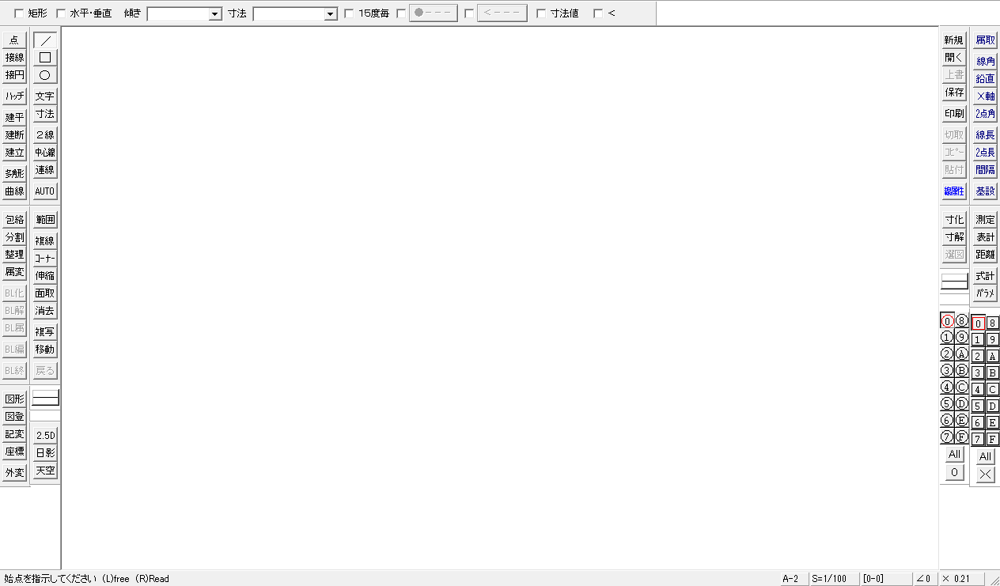

# Jw_cad for Windows — 解析と C 移植

Windows 用の 2 次元汎用 CAD **Jw_cad Version 10.03.6**（Jiro Shimizu &
Yoshifumi Tanaka、2026-09-05 版）を、実行ファイルを Ghidra で逆コンパイルして
解析し、C に書き直して最終的に WASM で動かすためのリポジトリです。

進め方は [lord_monarch_online_wasm](https://github.com/yomei-o/lord_monarch_online_wasm)
と [jwcad_dos_wasm](https://github.com/yomei-o/jwcad_dos_wasm) と同じ
——逆コンパイル出力と突き合わせて C に書き直し、ネイティブと WASM を同じ
ソースから作り、**原典の画面と 1 画素ずつ突き合わせて**検証する——ですが、
規模がまるで違います。

| | コード | 関数 |
|---|---:|---:|
| Super Depth | 70,731 バイト | 239 |
| JW_CAD for DOS | 1,451,937 バイト | 約 1,500 |
| **Jw_cad for Windows** | **5,582,629 バイト**（`.text`） | **26,061** |

うち相当量が静的リンクされた MFC と MSVC ランタイムなので、最初の仕事は
「何をする関数か」ではなく「**どれが Jw_cad 自身のコードか**」を切り分けることです。
それは RTTI から機械的に出せて、すでに出してあります（下記「クラス構成」）。

**いまできていること: 実行ファイルの構造の解明まで。** 画面・メニュー・ダイアログ・
文字列・ツールバーは**すべて正確に取り出せて**おり、C++ のクラス構成と継承関係、
どの関数がどのクラスの何番目の仮想関数か、まで復元しました。移植のコードは
これからです。続きに入る人は [RESUME.md](RESUME.md) から読んでください。

## 目標

**ネイティブの画面と WASM の画面が、ビットマップとして完全に一致すること。**
フォントの字形だけは環境が持つものに依存するので一致しなくてよい、という条件です。

そのため原典側の基準画像を先に取ってあります（`tools/shot.ps1`）。

```sh
powershell -ExecutionPolicy Bypass -File tools/shot.ps1 \
    -Exe orig/Jw_win.exe -Out docs/ref_test1.png -Open orig/Test1.jww -Screen
```



**`-Screen` が要ります。** Jw_cad 10.x は既定で Direct2D に描くので、
`PrintWindow` では枠だけ返ってきて**図面の部分が真っ白**になります。
デスクトップから画素を読む方が確実です。
（移植の突き合わせ対象としては、[設定]→[基本設定]→[一般(1)] で
**Direct2D を切った GDI 経路**を正解にするのが筋です。そちらは決定的で、
Direct2D のアンチエイリアスに追随する必要がなくなります。）

## 対象

`jww10036.exe` が配布されているインストーラ（Inno Setup 6.4.2）です。
サイレントインストールで中身が出ます。

```sh
./jww10036.exe /VERYSILENT /SUPPRESSMSGBOXES /NORESTART /NOICONS \
    "/DIR=C:\prog\claude3\jwcad_win_wasm\orig"
```

| ファイル | サイズ | 中身 |
|---|---:|---|
| `Jw_win.exe` | 8,537,840 | 本体。PE32 / i386、MSVC 2019（リンカ 14.29）、MFC 静的リンク |
| `common_lib.dll` | 3,687,296 | SXF（SFC/P21）入出力 |
| `common_lib_AP202.dll` | 4,376,960 | 同上 |
| `JWW2DXFConv.dll` | 383,072 | DXF 変換 |
| `JW_OPT*.DAT` | 22 本 | 建具などのパラメトリック図形。テキスト |
| `*.jww` | 14 枚 | サンプル図面 |
| `Jw_cad.chm` | 2,417,065 | ヘルプ |

`Jw_win.txt` によれば開発環境は **Visual Studio Community 2019**、
対応 OS は Windows 10 / 11 です。

### Jw_win.exe の構成

```
.text    VA 0x00401000  5,582,629 バイト   コード
.rdata   VA 0x00954000    694,806 バイト   定数・RTTI・インポート
.data    VA 0x009fe000     93,292 バイト   （仮想 93,292、ファイル上 40,960）
.rsrc    VA 0x00a15000  2,205,760 バイト   リソース
```

インポートは 22 DLL・676 関数。**GDI32 が 122、USER32 が 226** で、
古典的な Win32 / MFC のアプリです。加えて **d2d1 / DWrite**（Direct2D 描画）、
**gdiplus**（画像）、**MSVFW32**（`DrawDib`）、**IMM32**（日本語入力）。

```sh
python tools/peinfo.py orig/Jw_win.exe    # セクションとインポート一覧
```

## わかっていること

### 画面まわりは逆コンパイルしなくても正確に取り出せる

メニュー・ダイアログ・文字列・ツールバー・ビットマップは `.rsrc` に
文書化された形式でそのまま入っています。機械語から起こす必要はありません。

```sh
python tools/rsrc.py orig/Jw_win.exe decomp/res
```

| 出力 | 中身 |
|---|---|
| `menu.txt` | メニュー 3 本、270 行。コマンド ID 付き |
| `dialog.txt` | ダイアログ 108 枚、2,754 行。全コントロールの位置・大きさ・スタイル・ID |
| `string.txt` | 文字列 1,598 本 |
| `toolbar.txt` | ツールバー 183 本。**16×15 から 120×75 まで 12 段階の大きさ違い**を持っている |
| `dlginit.txt` | コンボボックスの初期項目（MFC の `RT_DLGINIT`） |
| `accel.txt` | アクセラレータ 2 本 |
| `bitmap/` | ビットマップ 469 枚（1.9 MB） |

ツールバーの `RT_TOOLBAR` は MFC の型番 **241**、`RT_DLGINIT` は **240** です
（`afxres.h`）。`tools/rsrc.py` は両方を解きます。

**ツールバーが 12 段階あるのは、Jw_cad が画面のボタンを段階的に拡大できるからです。**
移植でもこの 12 枚をそのまま使えば、どの倍率でもボタンが 1 画素まで一致します。

### クラス構成は RTTI から完全に出る

RTTI を有効にしてビルドされているので、`.rdata` にクラスごとの型記述子と、
vtable の直前に完全オブジェクトロケータが残っています。そこから
**クラス名・継承関係・どの関数が何番目の仮想関数か**が機械的に出ます。

```sh
python tools/rtti.py orig/Jw_win.exe decomp/rtti
# type descriptors 714, locators 749, classes with vtables 676
# vftable slots 41443 -> decomp/rtti/vftables.csv
# hierarchies 676 -> decomp/rtti/hierarchy.txt
```

714 クラスのうち MFC・ATL・STL を除いた **Jw_cad 自身のクラスは約 240**。
これが移植先のファイル構成そのものになります。

#### アプリの骨格

```
CJw_winApp   : CWinApp
CMainFrame   : CFrameWnd
CJw_winDoc   : CMiniDoc : CDocument
CJw_winView  : CView, CGamenJoken      ← 多重継承
CScreenWnd   : CWnd
CZoom        : CObject
CLayer / CLType / CStyle / CGamenJoken : （非多態、素のクラス）
```

#### 図面の要素 —— `CData` 系

```
CData : CObject
 ├ CDataSen     線        ├ CDataEnko   円弧    ├ CDataMoji   文字
 ├ CDataTen     点        ├ CDataSolid  ソリッド ├ CDataSunpou 寸法
 ├ CDataBlock   ブロック   ├ CDataList
 └ CData3DSen / CData3DEnko / CData3DSolid   （それぞれ 2D 版を継承）
CDataHensuu / CDataHenkei / CDataHndl : CObject
```

#### コマンド —— `CZukei` 系

コマンド 1 つに 1 クラス。メニューと 1 対 1 に対応します。

```
CZukei : CObject
 ├ CZukeiObject   ← 点・線・円弧・分割・中心線・2 線・曲線・多角形 …
 └ CZukeiSentaku  ← 範囲選択を伴うもの（複写・移動・複線・コーナー・面取・
                     消去・伸縮・包絡・整理・属性変更・図形・画像 …）
```

仮想関数から辿れるコードだけで、`CZukei*` と `CData*` と `CJw_win*` の
**69 クラスで 1,331,542 バイト**あります。これが移植の主戦場です。

| クラス | 仮想 | バイト |
|---|---:|---:|
| `CZukeiGazou`（画像） | 40 | 45,158 |
| `CZukeiMoji`（文字） | 50 | 42,855 |
| `CZukeiFukusha`（複写） | 48 | 42,781 |
| `CZukeiParametric`（建具等） | 46 | 35,770 |
| `CZukeiSentaku`（範囲選択） | 41 | 34,510 |
| `CZukeiShinshuku`（伸縮） | 46 | 33,440 |
| `CZukeiFukusen`（複線） | 49 | 32,622 |
| `CZukeiSunpo`（寸法） | 37 | 31,798 |
| …（以下 60 クラス） | | |

### 関数の棚卸し

```
26,061 関数 / 5,314,476 バイト
  名前あり  12,860 /   410,892   MFC・CRT（RTTI と復号したシンボルから）
  FUN_      13,201 / 4,903,584   まだ名前がないもの
```

`decomp/inventory.csv` が全関数の一覧です（番地・大きさ・呼び元数・呼び先数）。

### 逆コンパイル

```sh
ssh ... 'powershell -File C:\prog\jwwin\decomp_box.ps1 -Shards 10'
sh tools/decomp_get.sh
# 25983 functions, 25921 decompiled (99.8%)
# 25983 functions -> 654 files
```

26 MB の C が出ます。`tools/byclass.py` が vtable の割り当てを使って
**クラスごとのファイル**に仕分けます（`decomp/byclass/CJw_winDoc.c` など)。
仮想関数から辿れないものは `_unassigned.c` に入ります（20,316 関数）。

**MFC 派生クラスの vtable の並びは `CObject` の宣言順**です。

| スロット | |
|---|---|
| 0 | `GetRuntimeClass` |
| 1 | スカラ削除デストラクタ |
| **2** | **`Serialize`** |
| 3, 4 | `AssertValid` / `Dump` |

つまり `decomp/rtti/vftables.csv` で「スロット 2」を引けば、
どのクラスの読み書きもすぐ出ます。

| クラス | `Serialize` | 大きさ |
|---|---|---:|
| `CJw_winDoc` | `0x004d2820` → 本体 `0x00575010` | 22,125 |
| `CData` | `0x0042e690` | 345 |
| `CDataSen`（線） | `0x0042ea30` | 446 |
| `CDataEnko`（円弧） | `0x0042e7f0` | 569 |
| `CDataTen`（点） | `0x0042f340` | 437 |
| `CDataMoji`（文字） | `0x0048cff0` | 1,115 |
| `CDataSolid` | `0x0042ebf0` | 1,302 |
| `CDataSunpou`（寸法） | `0x0042f110` | 548 |
| `CDataBlock` | `0x0049b2c0` | 324 |

### 図面ファイル `.jww`

MFC の `CArchive` によるシリアライズです。先頭は

```
00000000  4a 77 77 44 61 74 61 2e   "JwwData."
00000008  58 02 00 00               版 0x258 = 600
0000000c  24 <36 バイト>            図面名（Shift-JIS、MFC の長さ前置文字列）
```

続いてレイヤグループ 16 × レイヤ 16 の表（状態と縮尺）、書込線色などの設定、
それから `CData` 派生オブジェクトの配列が `CArchive` のクラススキーマ付きで
並びます。`CDataSen::Serialize` を読むと、線の実体はこうです。

| オフセット | |
|---|---|
| `+0x08` | `double` x0 |
| `+0x10` | `double` y0 |
| `+0x18` | `double` x1 |
| `+0x20` | `double` y1 |
| `+0x28` | `byte`。読み込み時に `% 100` される |

座標に細工が入る経路がありますが、**普通のファイルでは効きません**。
`FUN_0057b2d0` が添字 `DAT_00a08ae4` を立てるのは引数が 2 のときだけで、
それは「要素があり、かつ `doc+0x338 % 100` に `0x18` のビットが立っている」
——つまり**保護を掛けて保存した図面**のときだけです。添字が 0 なら
`CData*::Serialize` の補正はまるごと飛ばされます。

## 道具

| | |
|---|---|
| `tools/pe.py` | PE の読み取り（セクション、RVA→ファイル位置、リソース木） |
| `tools/peinfo.py` | セクションとインポートの一覧 |
| `tools/rsrc.py` | メニュー・ダイアログ・文字列・ツールバー・ビットマップを取り出す |
| `tools/rtti.py` | RTTI からクラス名・継承・vtable を復元 |
| `tools/shot.ps1` | 原典の画面を PNG で撮る（基準画像） |
| `tools/analyze_box.bat` | ビルドマシンで Ghidra の自動解析（342 秒） |
| `tools/inventory_box.bat` | 全関数の棚卸し CSV |
| `tools/decomp_box.ps1` | `.text` を 10 分割して並列に逆コンパイル |
| `tools/ghidra_scripts/` | 上の 2 つが呼ぶ Ghidra スクリプト |

### ビルドマシンで回す

192.168.6.14 に Ghidra 12.1.3 と Temurin JDK 21 が入れてあります
（`jwcad_dos_wasm` の `tools/build_box_setup.ps1` で入れたもの。同じ版なので
ラップトップと出力が一致します）。5.5 MB の `.text` はラップトップで解析すると
一日仕事なので、ここは必ずビルドマシンを使います。

```sh
scp -i ~/.claude/keys/ort_build_key orig/Jw_win.exe yomei@192.168.6.14:C:/prog/jwwin/bin/
ssh -i ~/.claude/keys/ort_build_key yomei@192.168.6.14 'C:\prog\jwwin\analyze_box.bat'
ssh -i ~/.claude/keys/ort_build_key yomei@192.168.6.14 'C:\prog\jwwin\inventory_box.bat'
ssh -i ~/.claude/keys/ort_build_key yomei@192.168.6.14 \
    'powershell -ExecutionPolicy Bypass -File C:\prog\jwwin\decomp_box.ps1 -Shards 10'
```

自動解析は**一度だけ**走らせてプロジェクトを残します。逆コンパイルは
`-process -noanalysis -readOnly` で同じプロジェクトを開き直すので、
何度やり直しても解析し直しになりません。

## いまの一致具合

```sh
sh tools/check.sh
```

```
=== the frame against the original
docs/ref_start.png vs tests/out/frame.png: 1264x741, 3378 of 936624 differ (0.361%)
outside the text areas: 0 differ (0.000%)

=== native against WASM, pixel for pixel
tests/out/frame.png vs tests/out/wasm.png: 1264x741, 0 of 936624 differ (0.000%)
```

**枠は原典と 1 画素も違いません。** 残る 0.361% は全部、原典が Windows の
フォントで描いている文字です（`docs/textareas.txt` に列挙）。そこは
同じ字形を出せないので、別勘定にしてあります。

内訳の作り方は次のとおりです。

| | |
|---|---|
| `src/fb.c` | 32bit のフレームバッファ。矩形塗り・3D 枠・4bpp 転送だけ |
| `src/app.c` | 両方の入口が共有する画面。大きさを受け取って描くだけ |
| `src/main_win32.c` | ネイティブの窓。`SetDIBitsToDevice` を 1 回呼ぶだけ |
| `src/main_wasm.c` | ブラウザ側。`putImageData` するだけ |
| `src/ui.c` | 枠を描く。ドックバー・ボタン・レイヤ升目・ステータス行 |
| `src/gen/` | `.rsrc` から焼いたビットマップと、ボタンの配置表（生成物、非コミット） |
| `tests/frame.c` | 窓を開かずに PNG に落とす |
| `tools/cmp.py` | 原典と 1 画素ずつ比べて差分画像を出す |

ネイティブと WASM が**同じ `src/*.c` を通る**ので、両者が食い違ったら
それは移植が環境に依存した印になります。いまのところ**差は 0 画素**です。

ネイティブの窓（`jw_port.exe`）そのものを撮って原典と比べても同じ結果になります。

```sh
sh tools/build_native.sh
powershell -File tools/shot.ps1 -Exe jw_port.exe -Out tests/out/native.png -Client -NoResize
python tools/cmp.py docs/ref_start.png tests/out/native.png -i docs/textareas.txt
```

### 分かったこと

- **ツールバーのボタンの「文字」は絵**です。4bpp のビットマップ帯に焼かれていて、
  アンチエイリアスがありません。だからフォントを合わせなくても一致します。
- 無効なボタンは「地を 1 ドットずらして白、その上に影色」で描かれます。
- 押されたボタンは**窓に位相を合わせた市松**の地に、画像を 1 ドットずらして、
  **地の色を透過**して置きます。
- レイヤ升目は 19x21 のビットマップ（`2652` が左上用、`2662` がそれ以外）。
  ツールバーと違い**灰色は読み替えません**——`0xc0c0c0` だけが地の色になります。
- ボタンの立体枠は `DrawEdge` のどの組み合わせでもありません
  （外が `COLOR_BTNHIGHLIGHT`、内が `COLOR_3DLIGHT`）。自前で描いています。

## 進め方

規模からして一気には終わりません。原典の画面に近い側から順に積みます。

1. ~~**枠。**~~ 済み。文字以外は 1 画素も違いません。
2. **`.jww` を読む。** `CJw_winDoc::Serialize` と `CData*::Serialize` を
   突き合わせて、同梱の 14 枚が全部読めるところまで。
3. **描画。** `CJw_winView::OnDraw` から `CData*::Draw`。線種・線色・線幅と
   クリップを合わせる。ここが画素一致の本体です。
4. **マウスとコマンド。** `CZukei*` を 1 つずつ。クロックメニューも。
5. **WASM。** ネイティブと同じ `src/*.c` を Emscripten で。

## 検証

`tools/shot.ps1` で撮った原典の画面を正解として、同じ図面・同じ窓の大きさで
移植側の画面と 1 画素ずつ比べます。**フォントの字形だけは除外**します
（原典は Windows の MS ゴシックを `CreateFontIndirectW` で取るので、
ブラウザ側と同じにはなりません）。

## 著作権

Jw_cad の著作権は Jiro Shimizu & Yoshifumi Tanaka にあります。
`orig/` と `decomp/` はこのリポジトリに入れていません。手元の
`jww10036.exe` から上の手順で作ってください。
