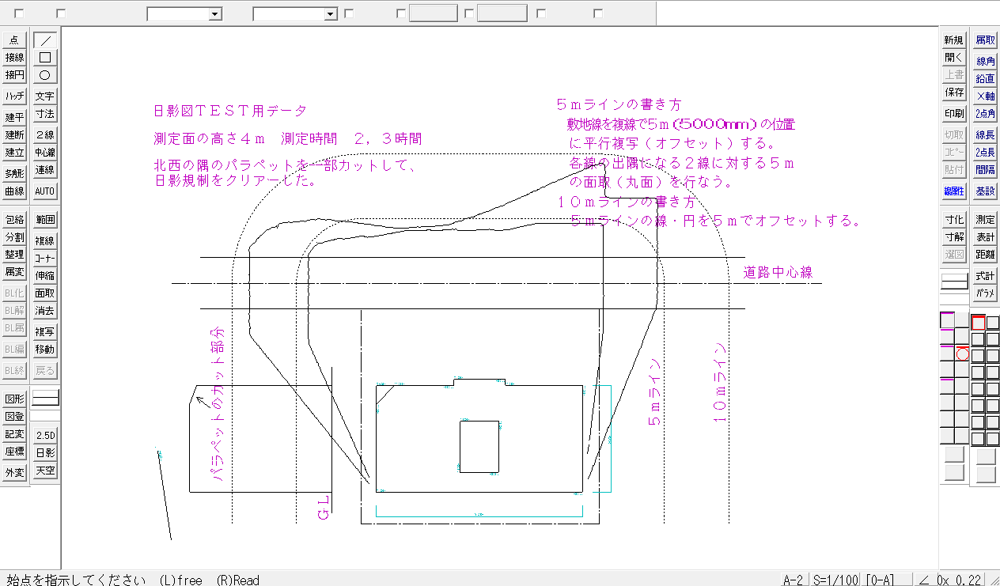
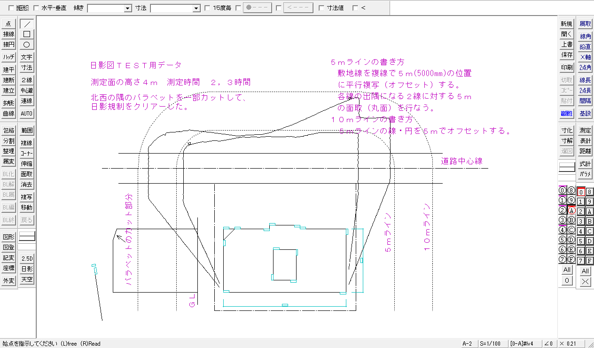

# Jw_cad for Windows — 解析と C 移植

Windows 用の 2 次元汎用 CAD **Jw_cad Version 10.03.6**（Jiro Shimizu &
Yoshifumi Tanaka、2026-09-05 版）を Ghidra で逆コンパイルして解析し、
C に書き直して WASM で動かすリポジトリです。

**動かす: <https://yomei-o.github.io/jwcad_win_wasm/>**
手元の `.jww`・`.dxf`・`.sfc`・`.jwc`・`.jws`・座標ファイルを開けて、
`.jww`・`.dxf`・`.sfc`・`.jwc` で保存できます（どこにも送られません）。
ホイールで拡大縮小、ドラッグで移動、Home で全体。



同じ図面を原典で開いたのが下です。**違うのは字形だけ**です。



## いまできること

**CAD として一通り使えます。**

| | |
|---|---|
| 描く | 線・矩形・円・円弧・点・連続線・文字（日本語入力つき）・ソリッド |
| 直す | 消去（部分・図形・範囲）・コーナー・線伸縮・複線・面取・分割・２線・中心線・多角形・寸法・ハッチ・曲線・包絡・データ整理・属性選択／属性変更 |
| 選ぶ | 範囲選択して複写・移動（倍率と回転角つき）・ブロック（化・解除・属性・編集・名前変更）・読取（中心点・線上点・交点・円周 1/4 点） |
| 枠 | メニュー・ツールバー・コマンドバー・レイヤ升目・ステータス行。**文字を除いて原典と 0 画素差**。窓の大きさを変えても追従します |
| ダイアログ | 線属性・書込み文字種変更・基本設定（8 タブ）・軸角・寸法設定・画面倍率・用紙サイズ。どれも文字を除いて 0 画素差 |

**ファイルの出し入れは 6 形式、読み書き両方あります。**

| | 読む | 書く | 突き合わせ |
|---|---|---|---|
| `.jww` | ✓ | ✓ | 原典の保存したものと 1 バイト違わず（2 万要素の往復も） |
| DXF | ✓ | ✓ | 原典の書いた DXF と 1 バイト違わず |
| SFC（SXF） | ✓ | ✓ | 同上。楕円弧・任意色・任意線種まで |
| JWC | ✓ | ✓ | 同上（頭の CSV の 5 つだけは原典のものを焼いています） |
| `.jws`（図形） | ✓ | ✓ | 図形読込／図形登録。書いたものは原典と 1 バイト違わず |
| 座標ファイル | ✓ | ✓ | 同上。文字（`cz`・`ck`・`ch`）まで |

形は [`docs/format-jww.md`](docs/format-jww.md)（`.jww`）に書き出してあります。

ネイティブの窓（`jw_port.exe`）とブラウザ（`index.html`）が**同じ
`src/*.c`** を通ります。両者が食い違えば、それは環境に依存した印です
——いまのところ**同梱の図面 16 枚とも 0 画素差**。

**続きに入る人は [RESUME.md](RESUME.md) から**読んでください。何が残って
いるかと、調べ方の記録への索引があります。

## 一致具合

```sh
sh tools/check.sh                              # 1,267 項目
sh tools/refshots.sh && sh tools/scoreall.sh   # 同梱 15 枚の採点
```

| | |
|---|---:|
| 枠（原典 対 移植、文字の外） | **0 画素** |
| 別の大きさの枠、キャプションとメニューバー | **0 画素** |
| native 対 WASM（16 枚） | **0 画素** |
| 同梱の図面 15 枚（文字の枠の外） | **524 画素**（5 枚は 0） |

残る 524 のほとんどは**部分円弧の環**で、原典はそこを GDI の `CDC::Arc`
に丸投げしています。環を描くのは `gdi32.dll` ですらなく**カーネルの
`win32kfull.sys`** なので、**読めません、測るしかありません**
（`tools/gdiarc.c` がメモリ DC に描かせて画素を数えます）。
詳しくは [`docs/notes-pixels.md`](docs/notes-pixels.md)。

**文字の枠は別勘定**です。`tests/shot.exe` が図面から字形の入る矩形を
書き出し、`tools/cmp.py` がそれを外します。**その矩形は窓の 14.3%**
（`Test6` は 35%）なので、524 は**窓の 85.7% についての数**です。

### 試験の網

| | |
|---|---|
| `sh tools/check.sh` | 1,267 項目。原典に同じ操作をさせた `.jww` と 1e-9 まで、原典の描いた画面と 1 画素ずつ |
| `tests/fuzz_test.c` | 壊れたファイル 95 万通り |
| `tests/cmdfuzz_test.c` | コマンドを手当たり次第に 204 万手 |
| `tests/bigcirc_test.c` ほか | 半径 1〜8,200・直線 12,636 本・全画素の拾い上げを端から端まで |
| `sh tools/asan.sh` | emscripten の clang で ASan/UBSan（w64devkit には `libasan` がありません）。**Windows 版では 787 万通り流しても出ない**ものが 8 つ出ました |
| `sh tools/asanseeds.sh` | 同じものを壊し方 20 通りで（数時間。`check.sh` には入れていません） |

**読み手・作図・入口をいじったら `asan.sh` を回してください。**
**乱打だけでは届かないものもあります** —— 円の環の置き場が溢れるのは
半径 5,792〜8,189 という 1.4 倍の帯でだけで、39 万件×198 ファイルを
ASan に通しても報告ゼロでした。そういうものは**定義域を端から端まで歩く
試験**のほうが早いです（[`docs/notes-tests.md`](docs/notes-tests.md)）。

## 原典を用意する

`jww10036.exe`（Inno Setup 6.4.2）を**ダウンロードしたそのまま**置いて
あります。中身は一切変えていません —— Jw_cad の使用条件（`Jw_win.txt`
「（３）転載及び配布」）が「プログラムを改変しないこと」「このままの形態で
配布すること」の二つなので、配布された形のまま置くのがいちばん条件に
合います。展開した `orig/` と、そこから機械的に作った `decomp/`・`src/gen/`
は**入れていません**（展開した形は「このままの形態」ではなく、逆コンパイルは
改変にあたりうるため）。どちらも手元で作れます。

```sh
./jww10036.exe /VERYSILENT /SUPPRESSMSGBOXES /NORESTART /NOICONS \
    "/DIR=<この木のある場所>\orig"
sh tools/gen.sh      # 生成物を全部（-q で原典を動かす手前まで）
sh tools/check.sh    # 全部の検査
```

`tools/gen.sh` の前半は `Jw_win.exe` を読むだけの計算で 1 分ほど、後半は
**原典を実際に起動して**コマンドバー・線属性ダイアログ・検査用の図面を
読み出すので 20 分ほど。順番に意味があります（`btnmap.py` は `rsrc.py` の
出力を、`mkcmd.py` は `btnmap.py` の出力を要ります）。中で何を呼んでいるかは
`tools/gen.sh` を直接読んでください。

**撮る側の条件はひとつだけ: 画面の拡大縮小 100%。**`Jw_win.exe` は
`<dpiAware>true</dpiAware>` を持つので、150% のまま起動すると 144dpi で
自分を描き直し、字も枠の位置も基準と別物になります。`tools/shot.ps1` は
窓を 1280×800 にするので作業領域も 800 行以上要ります。この条件さえ
合っていれば**機械が変わっても画素は同じ**でした。

原典の画面を撮るときは **`-Screen` が要ります**。Jw_cad 10.x は既定で
Direct2D に描くので `PrintWindow` では図面の部分が真っ白になります。
突き合わせの相手としては [設定]→[基本設定]→[一般(1)] で **Direct2D を
切った GDI 経路**が正解です（決定的で、アンチエイリアスに追随せずに済む）。

| ファイル | サイズ | 中身 |
|---|---:|---|
| `Jw_win.exe` | 8,537,840 | 本体。PE32 / i386、MSVC 2019（リンカ 14.29）、MFC 静的リンク |
| `common_lib*.dll` | 8.0 MB | SXF（SFC/P21）入出力 |
| `JWW2DXFConv.dll` | 383,072 | DXF 変換 |
| `JW_OPT*.DAT` | 22 本 | 建具などのパラメトリック図形。テキスト |
| `*.jww` | 14 枚 | サンプル図面 |

## 規模

| | コード | 関数 |
|---|---:|---:|
| Super Depth | 70,731 バイト | 239 |
| JW_CAD for DOS | 1,451,937 バイト | 約 1,500 |
| **Jw_cad for Windows** | **5,582,629 バイト**（`.text`） | **26,061** |

うち相当量が静的リンクされた MFC と MSVC ランタイムなので、最初の仕事は
「何をする関数か」ではなく「**どれが Jw_cad 自身のコードか**」の切り分け
です。**それは RTTI から機械的に出ます** —— 714 クラス、vtable 41,443
スロット、継承 676 本。MFC・ATL・STL を除いた Jw_cad 自身のクラスは約 240 で、
それがそのまま移植先のファイル構成になりました。
**画面まわり**（メニュー 3 本・ダイアログ 108 枚・文字列 1,598 本・
ツールバー 183 本・ビットマップ 469 枚）は `.rsrc` に文書化された形式で
入っているので、機械語から起こす必要すらありません。

クラスの木・vtable の並び・関数の棚卸し・逆コンパイルの回し方は
[`docs/notes-decomp.md`](docs/notes-decomp.md) に。

```sh
python tools/peinfo.py orig/Jw_win.exe        # セクションとインポート
python tools/rsrc.py   orig/Jw_win.exe decomp/res
python tools/rtti.py   orig/Jw_win.exe decomp/rtti
```

**5.5 MB の `.text` はラップトップで解析すると一日仕事**なので、Ghidra は
ビルドマシン（192.168.6.14、Ghidra 12.1.3 と Temurin JDK 21）で回します。
自動解析は**一度だけ**走らせてプロジェクトを残し、逆コンパイルは
`-process -noanalysis -readOnly` で開き直すので、やり直しても解析し直しに
なりません。手順は [`docs/notes-machine.md`](docs/notes-machine.md)。

## ソースの構成

| | |
|---|---|
| `src/fb.c` | 32bit のフレームバッファ。矩形塗り・3D 枠・4bpp 転送だけ |
| `src/app.c` | 両方の入口が共有する画面 |
| `src/main_win32.c` / `src/main_wasm.c` | ネイティブの窓 / ブラウザ。`SetDIBitsToDevice` と `putImageData` を 1 回呼ぶだけ |
| `src/jww.c` ほか | `.jww`・DXF・SFC・JWC・`.jws`・座標ファイルの読み書き |
| `src/view.c` | 用紙のミリを画面の画素へ |
| `src/draw.c` | 線・円弧・点・ソリッド。線種は 32 ビットのパターン |
| `src/text.c` `src/fontx.c` | 文字。字形は東雲フォント（Public Domain、`font/`） |
| `src/cmd.c` `src/pick.c` `src/houraku.c` ほか | コマンドと拾い上げ |
| `src/ui.c` | 枠を描く |
| `src/gen/` | `.rsrc` から焼いたビットマップと配置表（生成物、非コミット） |
| `tools/cmp.py` | 原典と 1 画素ずつ比べて差分画像を出す |

## 記録

| | |
|---|---|
| [RESUME.md](RESUME.md) | **いまどこまで・何が残っているか・進め方** |
| [docs/notes-pixels.md](docs/notes-pixels.md) | 画素を合わせる。円弧・線種・仮点・格子・採点 |
| [docs/notes-formats.md](docs/notes-formats.md) | ファイル形式 |
| [docs/notes-commands.md](docs/notes-commands.md) | コマンドとダイアログ |
| [docs/notes-tests.md](docs/notes-tests.md) | 試験とサニタイザ |
| [docs/notes-machine.md](docs/notes-machine.md) | 機械まわりと、原典の駆動 |
| [docs/notes-decomp.md](docs/notes-decomp.md) | 逆コンパイル出力から読めること |
| [docs/format-jww.md](docs/format-jww.md) | `.jww` の形 |
| [docs/notes-history.md](docs/notes-history.md) | 何がどの順に解けたか |

## 著作権

Jw_cad の著作権は **Jiro Shimizu & Yoshifumi Tanaka** にあり、フリー
ソフトウェアです。使用条件の全文はインストーラを展開して `orig/Jw_win.txt`
を読んでください。`orig/` と `decomp/` はこのリポジトリに入っていません。
